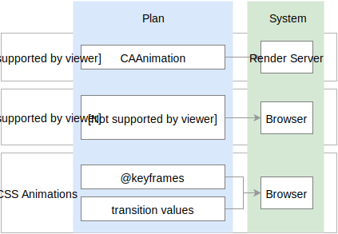

Status of this document: **Stable**

## The plan/execution pattern

**Plan**: a detailed proposal for doing or achieving something.

**Execution**: the carrying out or putting into effect of a plan, order, or course of action.

This pattern emphasizes a **separation** of the plan of motion from its execution.

This pattern is important because:

- It allows execution to occur in separate threads, processes, or workers.
- Execution relies on code. Plans can be represented in rich user interfaces. Plans can also be sent "over the wire".

### A plan of motion

A plan describes **what you want something to do**.

Every [primitive](../primitives.md) can be described with a plan. For example, "draggable" and "fade in" are two distinct plans. Their execution might use Gesture and Tween primitives.

Consider the following pseudo-code:

    fadeIn = Animation()
    fadeIn.property = "opacity"
    fadeIn.from = 0
    fadeIn.to = 1
    target.addPlan(fadeIn)

Here, `fadeIn` is the plan. The "fade in" logic **is not executed here**.

`addPlan` has registered the plan to a system. It does not matter which system, so long as the plan is eventually executed.

Also consider this pseudo-code:

    behavior = CustomBehavior()
    behavior.animate = function() {
      // A custom animation.
    }
    target.addplan(behavior)

In this example, the logic of the `animate` function is the plan. The `animate` function is not executed here. The `behavior` instance has been registered with a system. Again: it does not matter which system, so long as the plan is eventually executed.

> **Note:** This example emphasizes the separation between plan and execution.  Take care to author code that suits your platform.  Function plans may not be portable across thread/worker boundaries on some platforms.

Many plans can be attached to a single target. A single plan can also be attached to many targets.

Consider this pseudo-code:

    draggable = DraggableGesture()
    pinchable = PinchableGesture()
    rotatable = RotatableGesture()
    anchoredSpring = AnchoredSpringAtLocation(x, y)
    
    # Adding many plans to one target
    target.addPlans(draggable, pinchable, rotatable, anchoredSpring)
    
    # Reusing a plan on a second target
    target2.addPlan(draggable)

`target` is now expected to be directly manipulable. The target is also expected to spring back to the given `{ x, y }` coordinate. Whether this happens on release or at all times is an implementation detail of the plan's execution.

`target2` is expected to be draggable.

### Execution of a plan

Exactly how a plan is executed is less important than that it **is** executed and that the execution is able to occur elsewhere.

For example, a plan of "fade in" could reasonably be executed by a built-in animation system. The same plan could also be executed by a custom interpolation function. The plan doesn't know or care how it's executed.

Good systems of execution will carefully balance the needs of performance, power consumption, event coordination, and user interaction.

## Examples of this pattern

Most platforms have an implementation of this pattern for Tween animations. Few platforms, however, have implemented this pattern for other [primitives](../primitives.md).

