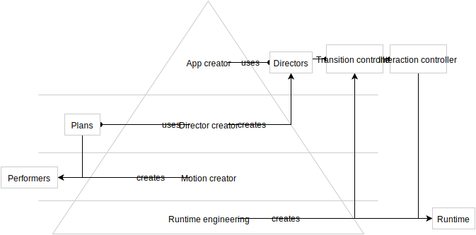

# Engineering spec

This section of the book defines engineering specifications and concepts.

The tone is meant to be both 🌟 aspirational 🌟 and 📚 educational 📚.

The audience is software engineers interested in building motion and interaction systems.

Throughout this chapter we write statements as simple facts. All are open for debate and conversation.

Much of what we'll describe is not new. Some things we'll discuss have existed for decades. Where applicable, we've included links to both ours and others' work in the field.

Within the best of our ability the provided specifications are platform and language-agnostic. We assume that you're working with an object-oriented language. We're inspired by functional programming but apply a pragmatic approach to system design.

# Tech stack

The following chart is the tech stack for Material Motion. Lower items in the chart must be built before higher order items can be built.

Each platform has its own implementation of this tech stack.

Tech is grouped into **focus areas**. Each focus area is represented by a colored region in the diagram.

# Education groups

We categorize the education of Material Motion into the following groups:

1. App creator
2. Director creator
3. Motion creator
4. Runtime engineering

Each group in the list above requires more knowledge of the Material Motion ecosystem than the group preceding it.

## Knowledge expectations

**App creator**: knows how to use and compose Directors.

**Director creator**: also knows how to create Directors and use Plans.

**Motion creator**: also knows how to create Plans/Performers.

**Runtime engineer**: also knows how to modify the runtime.

Creators should rarely, if ever, have to acquire an understanding of runtime engineering.

The Starmap is written for the runtime engineering group.

# Tech tree

The following chart is a [tech tree](https://en.wikipedia.org/wiki/Technology_tree) representation of the Starmap's engineering concepts. Dependencies are represented as arrows.

## Editing the tech tree

We use [draw.io](https://www.draw.io/) to edit the tech tree. Drag the .svg file in to draw.io and begin editing. Export the resulting content as an svg.

# Reading spec diagrams

We use spec diagrams to provide visual representations of the work required to build a particular thing. The following chart is an example of one of these diagrams.

We've annotated the important features.

# Library structure

The following diagram details the libraries we intend to create. We use the term library to mean "a collection of objects or types that is as small as possible, but no smaller".

The diagram includes dependencies between each library.

This diagram does not include:

- plan/performer families. E.g. Tween, Gesturing.
- Specific Director implementations. E.g. PhotoDirector, FadeDirector, SlideUpDirector.

