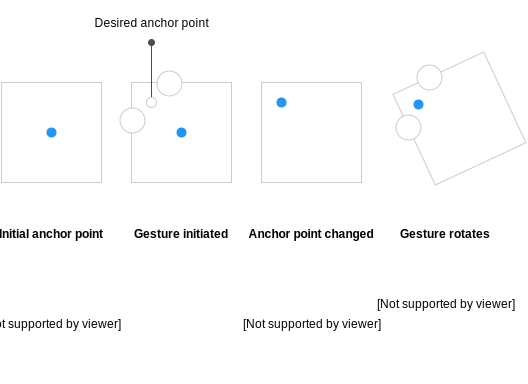

# Tween motion family

The direct manipulation motion family allows a motion engineer to describe gesture manipulation of elements.

|           | Android   | Apple     |
| --------- |:---------:|:---------:|
| Milestone | &nbsp;    | [Milestone](https://github.com/material-motion/material-motion-family-gestures-swift/milestone/1) |

## Examples

### Sticker editor

Scenario: Placing stickers on a photo/video. Each sticker can be dragged, pinched, and rotated.

    class StickerInteraction: InteractionDirector {
      let sticker
      
      func setUp(transaction) {
        transaction.add(plan: DirectlyManipulable(), to: sticker)
      }
    }

## Abstract types

### AnchorPointAdjustable

Contract: If a plan enables `wantsAnchorPointAdjustment` then the target's anchor point will be adjusted when gesturing begins.

    class Gesturable {
      var wantsAnchorPointAdjustment: Bool = false
    }

## Public plans

### DirectlyManipulable

Contract: registers Draggable, Pinchable, and Rotatable to the given target.

    class DirectlyManipulable: Gesturable {
      var panGestureRecognizer?
      var pinchGestureRecognizer?
      var rotateGestureRecognizer?
      
      defaults:
      wantsAnchorPointAdjustment = true
    }

### Draggable

Contract: delta x and y from the given gesture recognizer are added to the target's `position.x` and `position.y`. If no gesture recognizer is provided, then one is created.

    class Draggable: Gesturable {
      var panGestureRecognizer?
      
      defaults:
      wantsAnchorPointAdjustment = false
    }

### Pinchable

Contract: scale x and y from the given gesture recognizer are multiplied to the target's `scale.x` and `scale.y`. If no gesture recognizer is provided, then one is created.

    class Pinchable: Gesturable {
      var pinchGestureRecognizer?
      
      defaults:
      wantsAnchorPointAdjustment = true
    }

### Rotatable

Contract: z rotation from the given gesture recognizer is added to the target's `rotation.z`. If no gesture recognizer is provided, then one is created.

    class Rotatable: Gesturable {
      var rotationGestureRecognizer?
      
      defaults:
      wantsAnchorPointAdjustment = true
    }

## Private plans

Plans that are only accessible within this motion family.

### ChangeAnchorPoint

Contract: the anchor point of the view is immediately changed to the `newAnchorPoint`. The target's position is also updated to avoid noticeable movement of the target.

    class ChangeAnchorPoint {
      var newAnchorPoint
    }

## Performers

### DirectManipulationPerformer

Supported plans: `DirectlyManipulable`, `Draggable`, `Pinchable`, `Rotatable`.

`Draggable`, `Pinchable`, `Rotatable` emit:

- `ChangeAnchorPoint` on gesture begin event if any gesture's `wantsAnchorPointAdjustment` is enabled.

`DirectlyManipulable` emits:

- `Draggable`, `Pinchable`, `Rotatable` when the plan is added.

### AnchorPointPerformer

Supported plans: `ChangeAnchorPoint`.

The following diagram shows the desired effect of changing the anchor point of an element:

In pseudo-code:

    func onGestureInitiated() {
      let initialPositionInElement = Point(element.anchorPoint.x * element.width,
                                           element.anchorPoint.x * element.height)

      let gesturePositionInElement = gesture.positionInElement(element)
      let desiredAnchorPoint = Point(gesturePositionInElement.x / element.width,
                                     gesturePositionInElement.y / height)

      element.anchorPoint = desiredAnchorPoint
      element.position += gesturePositionInElement - originalPositionInElement
    }

