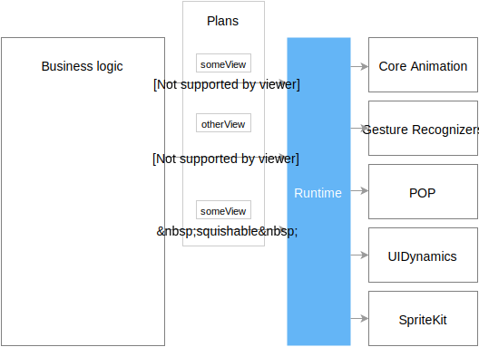

# Motion Runtime

The system described here emphasizes a separation of plan from its execution. We call it a Motion Runtime, or Runtime for short.

The purpose of a Runtime is to coordinate the expression of diverse types of motion and interaction. It is an abstraction layer between the application engineer and execution systems.

The following diagram shows where the Runtime lives in relation to a platform like iOS.

## Overview

Provide plans to a Runtime and it will find a way to execute them.

This sentence introduces two important questions:

1. How are plans provided to a Runtime?
1. How does a Runtime know how to execute Plans?

To answer the first question we introduce two new types into the system: the Plan and the Transaction.

> A Plan is an object representing **what you want something to do**. A Transaction aggregates requests for Plan-target associations.

To answer the second question we introduce one more type: the Executor.

Let's introduce three new types: `Plan`, `Transaction`, and `Executor`.

    class Transaction
    
    protocol Plan
    protocol Executor

The following diagram shows the relationship of these objects to one another:

Learn more about the [Runtime](runtime.md).

### Plan

Learn more about .

### Executors

Executors are objects created by a Runtime. Executors are expected to translate Plans into execution.

Learn more about [Executors](Executors.md).

### Transactions

Transactions are the mechanism by which Plans are committed to a Runtime.

Learn more about [Transactions](transactions.md).

<!--

LGTM:
- featherless
- markwei

-->
