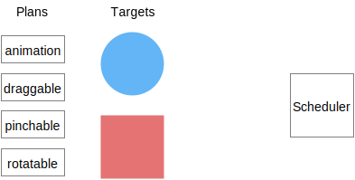

## Life of a Plan

Let's walk through the life of a Plan.

> Any code you see here is pseudo-code.

### Step 1: Create a Runtime

Runtimes are cheap and easy to create. Many Runtimes may exist in an application. Let's create one.

    runtime = Runtime()

### Step 2: Create Plans

All motion in a Runtime begins with a Plan. Let's create four different types of Plan:

    animation = Tween()
    animation.property = "opacity"
    animation.from = 0
    animation.to = 1
    
    draggable = Draggable()
    pinchable = Pinchable()
    rotatable = Rotatable()

### Step 3: Start a transaction and commit it

Let's say we have two targets - a circle and a square - to which we want to associate our plans.

Plans are added to a transaction. Plans are often added in relation to a specific target.

    transaction = Transaction()
    transaction.add(animation, circleView)
    transaction.add(draggable, squareView)
    transaction.add(pinchable, "name1", squareView)
    transaction.add(rotatable, "name2", squareView)
    transaction.remove("name2", squareView)
    transaction.add(draggable, circleView)

The Transaction's log might resemble the following pseudo-object:

    > transaction.log
    [
      {action:"add", plan: FadeIn, target: circleView},
      {action:"add", plan: Draggable, target: squareView},
      {action:"add", plan: Pinchable, name: "name1", target: squareView},
      {action:"add", plan: Rotatable, name: "name2", target: squareView},
      {action:"remove", name: "name2", target: squareView}
      {action:"add", plan: Draggable, target: circleView},
    ]

A transaction must be committed to a Runtime in order for it to take affect.

    runtime.commit(transaction)

After committing the above transaction, the Runtime's internal state might resemble the following:

> Note that `Rotatable` is not listed. This is because we also removed any Plan named "name2" in this Transaction.

The Runtime is now expected to execute its Plans.

### Step 4: Runtime creates Executors

The Runtime uses entities called **Executors** to execute types of Plans. The Executor is the specialized mediating agent between a Plan and its execution.

We'll assume a function exists that returns an Executor capable of executing a type of Plan. The method signature for this method might look like this:

    function executorForPlan(Plan, target, existingExecutors) -> Executor

Recall the transaction log we'd explored above:

    > transaction.log
    [
      {action:"add", plan: FadeIn, target: circleView},
      {action:"add", plan: Draggable, target: squareView},
      {action:"addNamed", plan: Pinchable, name: "name1", target: squareView},
      {action:"addNamed", plan: Rotatable, name: "name2", target: squareView},
      {action:"remove", plan: "name2", target: squareView}
    ]

The above operations committed to the following internal Runtime state:

Let's create Executors by calling our hypothetical `executorForPlan` on each target's Plans.

We've created three Executors in total. `circleView` has two Executors. `squareView` has one. You might be wondering now: "Why is there only one gesture Executor for the squareView?"

A single Executor instance is created for each *type* of Plan registered to a target. This allows Executors to maintain coherent state even when multiple Plans have been committed.

### Step 5: Executors execute Plans

The Runtime is now expected to send relevant events to each Executor instance.

Executors are often provided with the Plans that caused their creation. This allows the Executor to translate specific Plans in to actionable logic.

Some Executors require an `update` event. This event is called many times per second. The Executor can apply the perceived change in time to some internal progress

Some Executors execute their work remotely. For example, an Executor might turn a Plan into a system animation. The Executor in this case is responsible for informing the Runtime of two things: when the remote execution will start, and when the remote execution has ended.
