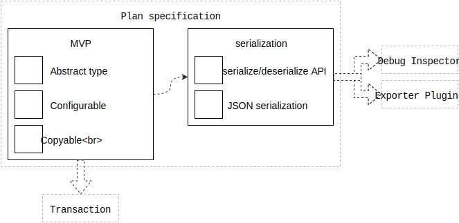

# Plan specification

This is the engineering specification for the Plan object.

A Plan is an object representing **what you want something to do**.

A Plan is the *plan* part of the separation of plan/execution.

Example Plan objects:

- `SquashAndStretch` describes a target squashing and stretching in the direction of its movement.
- `Tween` describes a tween animation.
- `Draggable` describes gestural translation.
- `AnchoredSpring` describes a physical simulation.

Printable tech tree/checklist:

---

<tt>MVP</tt>

**Abstract type**: A Plan is an abstract protocol or interface, if your language allows.

Pseudo-code example:

    protocol Plan {
    }

**Configurable**: Plans can have configurable properties.

Pseudo-code example:

    Tween: Plan {
      var fromValue
      var toValue
    }

**Copyable**: Plans can be copied.

Modifications made to the copy do not affect the original.

Pseudo-code example:

    planCopy = plan.copy()

<tt>/MVP</tt>

---

<tt>feature: serialization</tt>

Plans are serializable.

Serializable Plans can be sent over a wire or recorded to disk.

**serialize/deserialize API**: Provide APIs for serializing and deserializing a Plan.

Example pseudo-code:

    # Serialize the plan
    json = plan.serialize()
    
    # Create a new Plan from json
    plan = Plan(json)

**JSON serialization**: A serialized Plan is represented in JSON.

<tt>/feature: serialization</tt>

