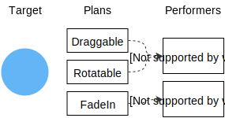

# Scheduler specification

This is the engineering specification for the `Scheduler` object.

|                  | Android | Apple |
| ---------------- |:-------:|:-----:|
| First introduced | [Runtime 1.0.0](https://github.com/material-motion/material-motion-runtime-android/releases)   | [Runtime 1.0.0](https://github.com/material-motion/material-motion-runtime-objc/releases/tag/v1.0.0) |

## Features

- [Named plans](named-plans.md)
- [Target selectors](target-selectors.md)

## Overview

A scheduler accepts transactions and creates performers. The scheduler generates relevant events for performers and observers and monitors activity.

Printable tech tree/checklist:

## MVP

**Simple initializer**: A scheduler is cheap to create.

Example pseudo-code:

    scheduler = Scheduler()

**commit API**: Provide an API to commit transactions to a scheduler.

Example pseudo-code:

    scheduler.commit(transaction)

Requires: [Transaction](transaction.md)

**One instance of a performer type per target**: Create one performer instance for each *type* of performer required by a target. This allows multiple plans to affect a single performer instance. The performers can then maintain state across multiple plans.

> Consider the following pseudo-code transaction involving physical simulation:
> 
>     transaction = Transaction()
>     transaction.add(Friction(), circleView)
>     transaction.add(AnchoredSpringAtLocation(x, y), circleView)
>     scheduler.commit(transaction)
> 
> `circleView` now has two plans and one performer, a `PhysicalSimulationPerformer`. Both plans are provided to the performer instance.
> 
> The performer knows the following:
> 
> - It has two forces, both affecting `position`.
> - It needs to model `velocity` for the `position`.
> 
> The performer creates some state that will track the position's velocity.
> 
> The performer can now:
> 
> 1. convert each plan into a physics force,
> 2. apply the force to the velocity, and
> 3. apply the velocity to the position
>
> on every update event.
> 
> Alternatively, consider how this situation would have played out if we had one performer for each plan. There would now be two conflicting representations of `velocity` for the same `position`. On each frame, one performer would "lose". The result would be a confusing animation.

Note that "one performer per type of plan" does not resolve the problem of sharing state across different types of plans. This is an open problem.

**Plan ↔ performer association**: The scheduler must be able to translate plans into performers.

This lookup can be implemented in many ways:

- Plans define their performer type

  This requires plans to be aware of their performers, which is not ideal. It does, however, avoid a class of problems that exist if performers can define which plans they fulfill.
  
  > This is the simpler approach, and may be used for MVPs.
  
  Example pseudo-code:
  
      class SomePlan {
        function performerType() {
          return SomePerformer.type
        }
      }
      
      # In the scheduler...
      performerType = plan.performerType()
      performer = performerType()

- Map performer type to plan type with look-up table.

  Performers define which plans they can fulfill. This approach allows plans to be less intelligent. But it introduces the possibility of performers conflicting on a given plan. The scheduler would need to be able to determine which one to use.
  
  Example pseudo-code:
  
      # In some initialization step...
      scheduler.performerType(SomePerformer.type, canExecutePlanType: SomePlan.type)
      
      # In the scheduler...
      performerType = plan.performerTypeForPlan(plan)
      performer = performerType()

**Activity state**: Activity state is one of either active or at rest. The scheduler must provide a public read-only API for accessing this state.

Pseudo-code example:

    public enum ActivityState {
      .Active
      .AtRest
    }
    
    Scheduler {
      public function activityState() -> ActivityState
    }

A scheduler is active if any of its performer instances are active.

---

## Experimental ideas

**Event: target activity state did change**: Any time a specific target changes its idle/active state it should fire an observable event.

This is a more focused event than the "scheduler activity state did change".

This event enables reactionary plans, i.e. registering new plans once a target has entered an idle state.

    Transaction {
      function addActivityStateObserverForTarget(target, function)
    }
    
    transaction.addActivityStateObserverForTarget(target, function(newState) {
      // Start a new transaction and commit it to the scheduler...
    })

NOTE: It may be more valuable to have performer-level idling. Target-level idling may not be helpful. It's unclear how performer-level idling would work, given that the outside system should generally be unaware of performers.

    Transaction {
      function addActivityStateObserverForPlan(plan, function)
    }
    
    transaction.addActivityStateObserverForPlan(plan, function(newState) {
      // Start a new transaction and commit it to the scheduler...
    })

---

## Open topics

The following topics are open for discussion. They do not presently have a clear recommendation.

- When should performers be removed from a scheduler?
- Should schedulers support target-less plans?

---

## Proposed features

**Tear down API**: Provide an API to tear down a scheduler.

This API would terminate all active performers and remove all registered plans.

It's unclear if this is a necessary feature.

Example pseudo-code:

    scheduler.tearDown()

**Garbage-collecting performers**

To prevent a monotonically-increasing heap of performers from introducing a potential memory leak, a scheduler may desire some strategy for removing references to old performers.

The [JavaScript implementation](https://github.com/material-motion/material-motion-experiments-js/) removes references after the scheduler has be at rest for at least 500ms.  This was chosen for a few reasons:

- According to the [RAIL](https://developers.google.com/web/tools/chrome-devtools/profile/evaluate-performance/rail?hl=en) pattern, users are unlikely to notice a slow first frame in an animation.  This makes the first frame a good time to instantiate new objects.

- The delay ensures that plans can be committed to the scheduler one-frame-at-a-time without triggering garbage collection.

- 500ms is long enough that new plans in this sequence are unlikely, but short enough that the user is unlikely to be initiating new plans.

> Under this strategy, it is especially important that performers can read the state that another performer may have set on a target.  Otherwise, when a performer is garbage collected and a new one takes its place, the new performer might reset the starting position of a target.  This would be jarring.

