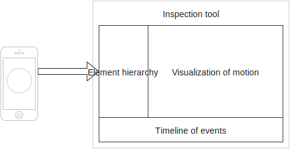

# Serialization

Related specifications: [Plan serialization](runtime/plan-serialization.md).

Serialization is what allows motion families to be transmitted over a pipe.

## Applications of serialization

Serialization enables a wide variety of use cases:

* Export motion from a design tool.

  * Export as code
  * Export as binary file format

* Inspect motion in a production application.




* Tweak motion in a running application.
  * Able to register new Plans to a runtime.
  * Able to modify parameters of existing Plans and see changes immediately.
  * Able to modify named variables in the system. E.g. `destinationOpacity = <slider with range of 0...1, default 0.1>`


## Motion family serialization

Plan types must be serializable to a binary format containing the following keys:

* namespace: `String`
* name: `String`
* payload: `Data`

A combination of `namespace` and `name` allows the Runtime to uniquely identify a plan in a given system.

The following example serializes a specific Tween plan:

```
let fadeIn = Tween(keyPath: "opacity")
fadeIn.from = 0
fadeIn.to = 1
fadeIn.curve = .easeIn

data = Serializer.toBinary(fadeIn)
{
  namespace: "Tween",
  name: "Tween",
  payload: {
    keyPath: "opacity"
    from: 0,
    to: 1
    curve: "easeIn"
  }
}
```

The following example serializes a more abstract FadeIn compositional plan:

```
let fadeIn = FadeIn()

data = Serializer.toBinary(fadeIn)
{
  namespace: "Tween",
  name: "FadeIn",
  payload: {}
}
```

**Payload contents**

Plans can choose any format for their payload.

Plans should consider how they will handle future changes to their payload format.

## Transaction serialization

A serialized transaction contains plans and associated target selectors in a log.

Example pseudo-data:

```
[
  {
    operation: "add",
    plan: SerializedPlan,
    targetSelector: "#contextView"
  },
  {
    operation: "add",
    name: "someName",
    plan: SerializedPlan,
    targetSelector: "Photo"
  }
]
```

Example pseudo-code reading a transaction from a stream and committing it to a scheduler:

```
let serializer = MotionSerializer
let transaction = serializer.transactionFromStream(stream)
scheduler.commit(transaction: transaction)
```

---

Status of this document:


## Draft notes

| v from v \/ to =&gt; | Runtime | File | Inspection tool | Design tool |
| --- | --- | --- | --- | --- |
| Runtime |  | Motion interchange | Transaction stream |  |
| File | Motion interchange |  | Visualize motion | Import motion |
| Inspection tool | Modification of state |  |  |  |
| Design tool | Motion interchange | Motion interchange | Modification of state |  |

Intended use cases:

* Export motion from a design tool.
* Inspect motion in a production application.

Engineering requirements:

* Able to read\/write Plans from a binary format on any platform.
* Able to generate code from a binary format.

## Dynamic inspection

Intended use cases:

* Visualizing a motion system in real time.

* Modifying a motion system in real time.

  * Able to register new Plans to a runtime.
  * Able to modify parameters of existing Plans and see changes immediately.
  * Able to modify named variables in the system. E.g. `destinationOpacity = <slider with range of 0...1, default 0.1>`


Engineering requirements:

* Able to subscribe to a stream of transactions.
* Able to query\/visualize state of any performer in the runtime.
* Able to remotely commit new Plans to the runtime.
* Able to modify active performer state. E.g. spring coefficients or easing curve.
* Able to modify named variables in the system.

## Thoughts

* It's not clear that there is benefit to forcing a standard means of serialization across all plan types across all families. E.g. "Let's use json for everything".
* It is clear that - within a given family - plans should be serializable across all platforms for which that family exists. For example, an abstract "Tween" family should be serializable across Android, Web, and iOS. A Core Animation family likely should not be. JSON might be the right thing for a family in this context, but it could be equally valid to use a binary format instead. The implementor of a family must be allowed to decide.
* The spec for serialization should encourage defining serialization mechanisms within a given **family of plans**. We should provide a software design spec for Plans and some abstract "Serializing" entity. Such a serializing entity could hook up to a common system that thinks in terms of runtimes and serializing entities. This common system could read\/write\/transmit plans over the wire.

Software design goals:

* Plan families should be encouraged to implement a plan serializer.
* The Runtime should provide a SerializerManager object that can receive plans from disk\/network and provide them to the correct serializer. The reverse should hold true of moving plans to disk\/over network.

Why this matters:

* The interesting part of serialization is not the data format. The interesting part is whether you can easily transport plans across systems in a consistent manner.
* A tool that is able to think in terms of a cross-platform "Tween" language shouldn't strictly have to care about whether the data is json or binary.

What this aids:

* Debug tooling.
* Design tooling.

